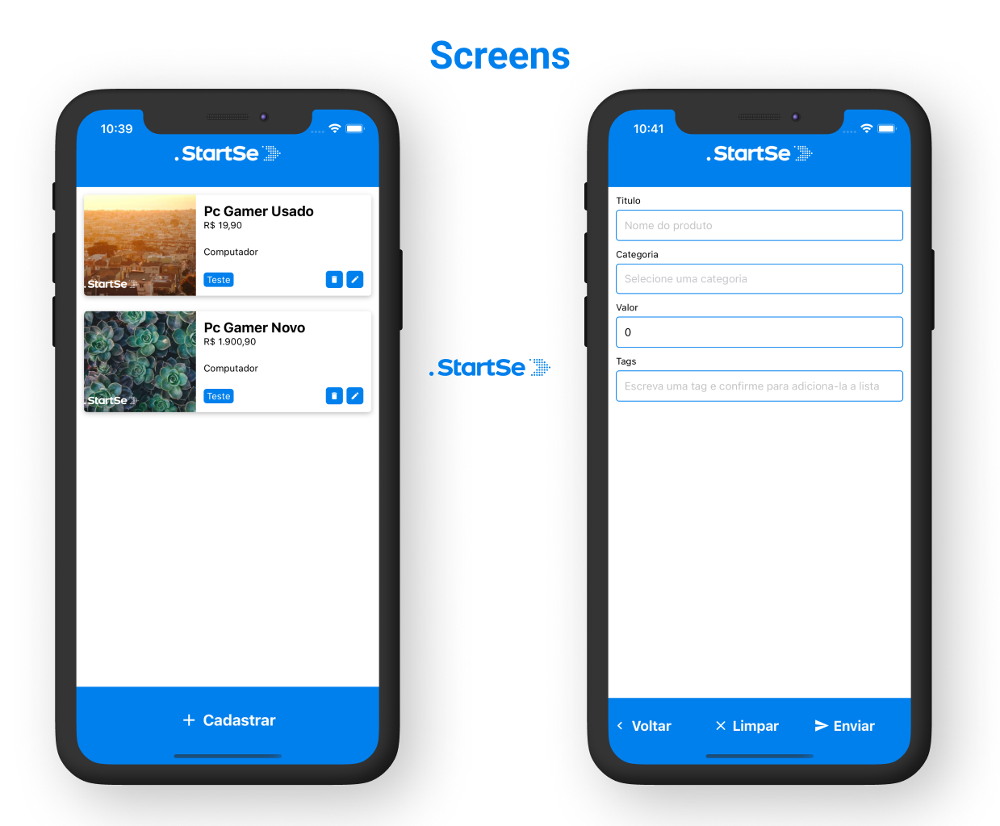
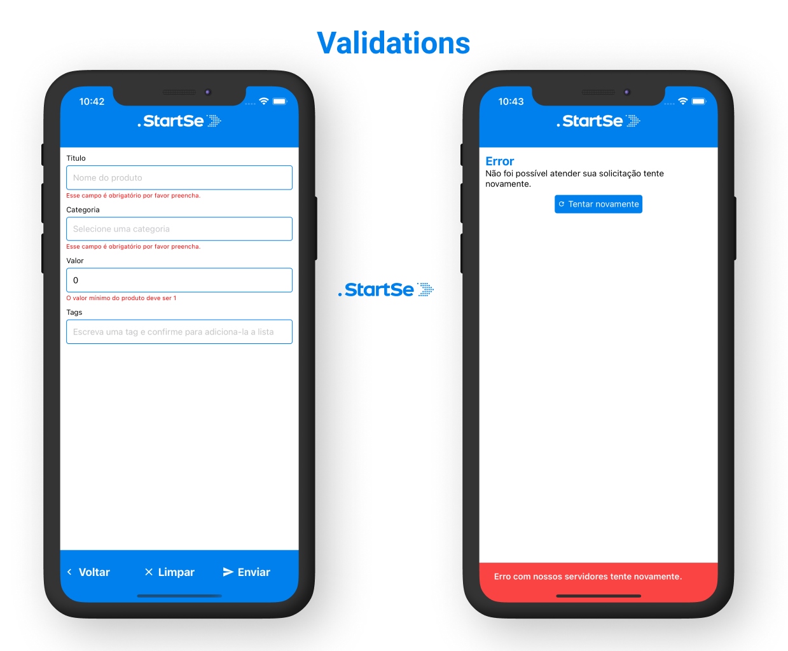
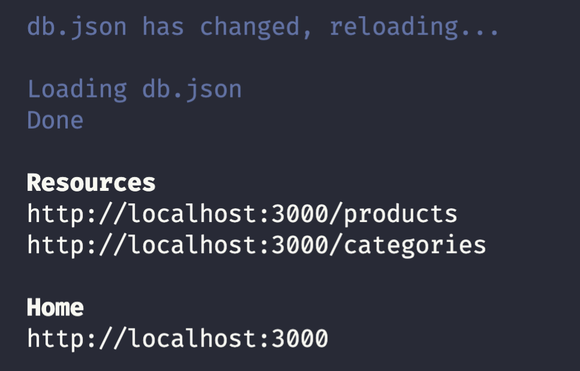

# StartSe - Teste Mobile

Teste para vaga de desenvolvedor mobile na StartSe, o desafio era criar uma aplicação onde, o usuário tem uma lista de produtos, uma tela para cadastrar novos produtos e a possibilidade de editar/excluir esses produtos. Utilizando React Native, ReactNavigation, Styled Components, Testes com Jest.

# Telas





# Setup

O projeto utiliza `yarn`  é necessário que na sua máquina tanto o yarn quanto o npm estejam instalados.

Não foi gerado nenhum `apk` ou `ipa` do app, portanto é necessário buildar na sua máquina. para isso vai ser necessário ter o ambiente preparado para funcionalidade, tais quais como java e xcode.

Nesse link tem todas as instruções para deixar o ambiente configurado: [https://react-native.rocketseat.dev/](https://react-native.rocketseat.dev/)

## Rodando o projeto

1. Abra dois terminais na raiz do projeto.
2. `yarn` ⇒ para baixar os pacotes.
3. Após instalar os pacotes `npx pod install` ⇒ para instalar os pods do IOS caso rode em um emulador ios.
4. Em um terminal execute o `yarn db` para iniciar a api.
5. Em outro terminal execute `yarn ios` ou `yarn android`.

# Api

Configurei uma api simples utilizando o pacote `json-server`

ao rodar `yarn db` uma mensagem como essa deve ser exibida no seu terminal:



# Estrutura

Listo aqui o que achei mais importante.

```jsx
src/
	|_/@types/ => todo tipo ou modificação de modulos de bibliotecas ou DTOS de algum componente ou função.
	|_/assets/ => imagens, fontes ou arquivos de midia utilizados no app.
	|_/components/ => componentes ultilizados pelo app.
	|_/config/ => qualquer configuração que precise ser reutilizada no app.
	|_/i18n/ => internacionalização para dar suporte a multi idiomas.
	|_/services/ => camada de serviço para qualquer dados externos, api, graphql, banco de dados e etc.
	|_/store/ => camada de estados globais da aplicação.
	|_/style/ => estilos globais e themeprovider para aplicar estilos no app como um todo.
	|_/utils/ => utilitários e funcões auxiliares.
	|_/views/ => camada de apresentação do app com todas as telas.
index.js => ponto de partida de qualquer app react native.
db.json => arquivo json que simula uma api rest.
```

# Destaques

- Utilização de typescript no projeto
- Boilerplate implementado com plop generators (  branch boilerplate)
- Eslint + Prettier
- Jest + React native testing library
- Jest + Styled Components
- Redux Duck Pattern
- Internationalization (i18n)
- Monitor State ( Reactotron)
- Dry - Dont Repeat yourself

# Desafios

- Tive um problema com o jest ao renderizar svg, pesquisei e fiz algumas alterações mas não consegui,  devido ao tempo deixei pro final e consegui implementar um mock temporátrio.


# Testes

No projeto eu testei relativamente pouco devido ao tempo, os testes foram em cima dos componentes para verificar se apresentavam os dados corretamente.

Talvez fosse interessante testar as funções e criar alguns mocks para o redux, no entanto isso da muito trabalho.


# Video

Gravei um vídeo usando um pouco o app pelo emulador do IOS, deixarei o link aqui de fallback.

[https://vimeo.com/530139240](https://vimeo.com/530139240)

# Agradecimentos

O projeto apesar de ser 'simples' foi desafiador pois eu mesmo quis utilizar coisas que não dominava 100%. como jest e duck patterns, no final consegui aprender bem os dois e o projeto ficou bem mais organizado, então agradeço pois vai me fortalecer muito ter entendido esses conceitos.
